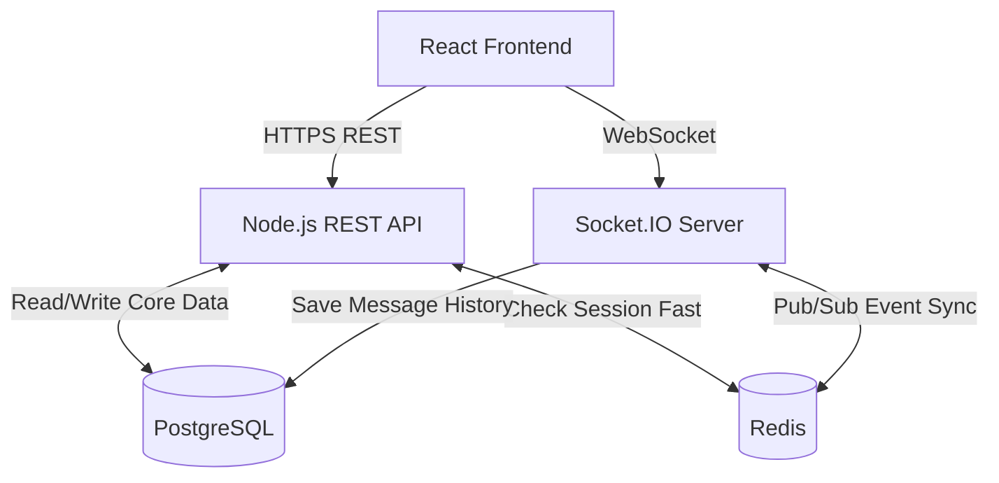

# Database Architecture for Connectify

This document outlines the database strategy for the Connectify application, detailing how many databases are needed, what types are used, and how they connect to the rest of the system.

## 1. How Many Databases Are Required?

The Connectify backend architecture requires **two distinct databases** to handle different workloads efficiently:
1. A **Relational Database** for persistent, structured data storage.
2. An **In-Memory Datastore** for fast caching and real-time message broadcasting.

---

## 2. What Kind of Databases Are Used?

Based on the system design, the recommended databases are:

### A. PostgreSQL (Primary Database)
- **Type:** Relational Database Management System (RDBMS).
- **Purpose:** Acts as the main source of truth and persistent storage. It stores structured data that needs reliable, long-term retention.
- **What it stores:** 
  - Users (authentication details, profile info)
  - Chat Rooms (room details, settings)
  - Room Memberships (mapping of which users are in which rooms)
  - Message History (long-term chat logs)
- **Why PostgreSQL:** It provides robust data integrity (ACID compliance), complex querying, and strong relational mapping, which is perfect for a chat app where users, rooms, and messages are highly interconnected.
- **ORM Recommendation:** Prisma (if using Node.js) or Django ORM.

### B. Redis (In-Memory Datastore)
- **Type:** In-Memory Key-Value Store & Message Broker.
- **Purpose:** Used for high-speed operations that require sub-millisecond latency.
- **What it does:**
  - **Session/Token Management:** Stores refresh token allow-lists/block-lists for fast lookups and quick logout invalidation.
  - **WebSocket Pub/Sub:** Acts as the communication bridge between multiple server instances.
- **Why Redis:** Its in-memory nature makes it blazing fast. For real-time applications where every millisecond counts, fetching sessions from Redis or routing messages through it is much faster than querying a disk-based database like PostgreSQL.

---

## 3. How the Databases Are Connected

The databases are connected to the backend servers (REST API and WebSocket Server) rather than directly to the client frontend. Here is how data flows between the components:

### The Connection Flow

1. **REST API Server ↔ PostgreSQL**
   - The Node.js Express server establishes a connection pool to PostgreSQL.
   - When a user signs up, creates a room, or fetches past messages, the REST API queries PostgreSQL (usually via an ORM like Prisma) to read or write the data.

2. **REST API Server ↔ Redis**
   - For protected routes, the API server checks Redis to validate if a user's session or refresh token is still active, bypassing the slower PostgreSQL database.

3. **WebSocket Server ↔ PostgreSQL**
   - When a live message is sent via WebSocket, the server immediately inserts the message record into the PostgreSQL database to ensure it is permanently saved before anyone else receives it.

4. **WebSocket Server ↔ Redis (Pub/Sub for Real-Time Sync)**
   - To support **scalability**, you might run multiple instances of your Node.js WebSocket server. 
   - **How it works:** If User A (connected to Server 1) sends a message to User B (connected to Server 2), Server 1 saves the message to PostgreSQL and then *Publishes* the message to a Redis channel. Server 2 is *Subscribed* to that channel, receives the message from Redis, and pushes it down the WebSocket to User B.
   - This connection is usually managed by the `socket.io-redis-adapter`.

### Architecture Diagram

